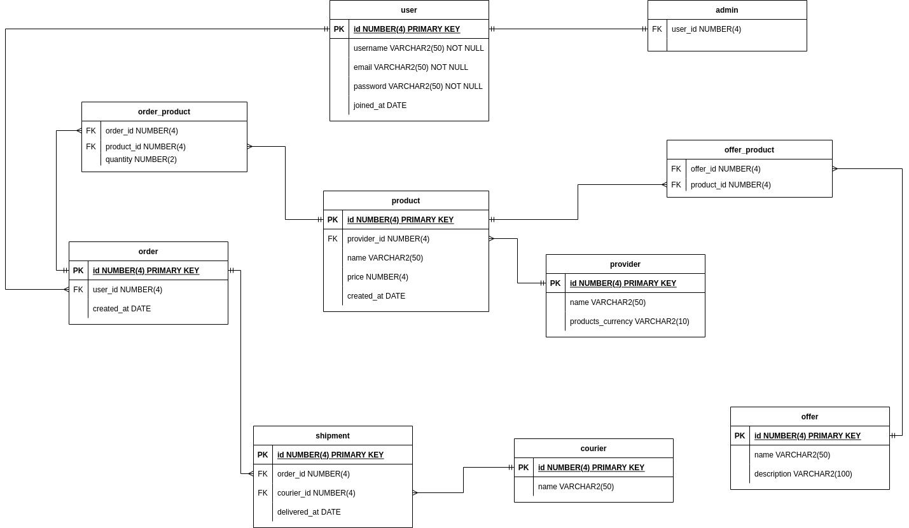

# Online shop database design

* mention how to inspect errors: `show errors`

## Tasks

## 1

> Prezentați pe scurt baza de date (utilitatea ei).

Prezenta baza de date modeleaza un magazin online. In ziua de azi exista numeroase servicii pe Internet ce-si pot dovedi utilitatea doar prin cateva click-uri. Datorita lor, si nu numai, viata oamenilor a devenit mult mai simpla deoarece ei isi pot aloca mai mult timp activitatilor prioritare. Asadar, acest proiect urmareste crearea unei arhitecturi care sta la baza unui astfel de serviciu.

## 2

> Realizați diagrama entitate-relație (ERD).

<div style="text-align: center;">
  
</div>

## 3

> Pornind de la diagrama entitate-relație realizați diagrama conceptuală a modelului propus, integrând toate atributele necesare.

<div style="text-align: center;">
  
</div>

## 4

> Implementați în Oracle diagrama conceptuală realizată: definiți toate tabelele, implementând toate constrângerile de integritate necesare (chei primare, cheile externe etc).

```sql
-- Main entities

create table "user" (
  id number(4) constraint user_pk primary key not null,
  username varchar2(50) not null,
  email varchar2(50) not null,
  password varchar2(50) not null,
  joined_at date
);

create table "admin" (
  user_id number(4) not null,

  constraint fk_admin_user
  foreign key (user_id)
  references "user"(id)
  on delete cascade
);

create table "provider" (
  id number(4) constraint provider_pk primary key not null,
  name varchar2(50) not null,
  products_currency varchar2(10) not null
);

create table "product" (
  id number(4) constraint product_pk primary key not null,
  provider_id number(4) not null,
  name varchar2(50) not null,
  price number(4),
  created_at date,

  constraint fk_product_provider
  foreign key (provider_id)
  references "provider"(id)
  on delete cascade
);

create table "order" (
  id number(4) constraint order_pk primary key not null,
  user_id number(4) not null,
  created_at date,

  constraint fk_order_user
  foreign key (user_id)
  references "user"(id)
);

create table "courier" (
  id number(4) constraint courier_pk primary key not null,
  name varchar2(50) not null
);

create table "offer" (
  id number(4) constraint offer_pk primary key not null,
  name varchar2(50) not null,
  description varchar2(100) not null
);

-- Associative tables

create table "order_product" (
  order_id number(4) not null,
  product_id number(4) not null,
  quantity number(2) not null,

  constraint fk_order_product_order
  foreign key (order_id)
  references "order"(id),

  constraint fk_order_product_product
  foreign key (product_id)
  references "product"(id)
);

create table "shipment" (
  id number(4) constraint shipment_pk primary key not null,
  order_id number(4) not null,
  courier_id number(4) not null,

  constraint fk_shipment_order
  foreign key (order_id)
  references "order"(id),

  constraint fk_shipment_courier
  foreign key (courier_id)
  references "courier"(id)
);

create table "offer_product" (
  offer_id number(4) not null,
  product_id number(4) not null,

  constraint fk_offer_product_offer
  foreign key (offer_id)
  references "offer"(id),

  constraint fk_offer_product_product
  foreign key (product_id)
  references "product"(id)
);
```

## 5

> Adăugați informații coerente în tabelele create (minim 5 înregistrări pentru fiecare entitate independentă; minim 10 înregistrări pentru tabela asociativă).

```sql
-- Main entities

insert into "user" VALUES (1, 'username_1', 'foo_1@bar', 'password_1', to_date( '15-12-2021','dd-mm-yyyy'));
insert into "user" VALUES (2, 'username_2', 'foo_2@bar', 'password_2', to_date( '15-12-2021','dd-mm-yyyy'));
insert into "user" VALUES (3, 'username_3', 'foo_3@bar', 'password_3', to_date( '15-12-2021','dd-mm-yyyy'));
insert into "user" VALUES (4, 'username_4', 'foo_4@bar', 'password_4', to_date( '16-12-2021','dd-mm-yyyy'));
insert into "user" VALUES (5, 'username_5', 'foo_5@bar', 'password_5', to_date( '17-12-2021','dd-mm-yyyy'));

insert into "admin" values (1);

insert into "provider" values (1, 'provider_1', 'RON');
insert into "provider" values (2, 'provider_2', 'RON');
insert into "provider" values (3, 'provider_3', 'EUR');
insert into "provider" values (4, 'provider_4', 'EUR');
insert into "provider" values (5, 'provider_5', 'USD');

insert into "product" values (1, 1, 'product_1', 10, to_date('17-12-2021','dd-mm-yyyy'));
insert into "product" values (2, 1, 'product_2', 10, to_date('17-12-2021','dd-mm-yyyy'));
insert into "product" values (3, 2, 'product_3', 10, to_date('17-12-2021','dd-mm-yyyy'));
insert into "product" values (4, 3, 'product_4', 10, to_date('18-12-2021','dd-mm-yyyy'));
insert into "product" values (5, 3, 'product_5', 10, to_date('18-12-2021','dd-mm-yyyy'));
insert into "product" values (6, 3, 'product_6', 10, to_date('19-12-2021','dd-mm-yyyy'));
insert into "product" values (7, 4, 'product_7', 10, to_date('20-12-2021','dd-mm-yyyy'));
insert into "product" values (8, 4, 'product_8', 10, to_date('20-12-2021','dd-mm-yyyy'));
insert into "product" values (9, 5, 'product_9', 10, to_date('21-12-2021','dd-mm-yyyy'));
insert into "product" values (10, 5, 'product_10', 10, to_date('22-12-2021','dd-mm-yyyy'));

insert into "order" values (1, 1, to_date('24-12-2021','dd-mm-yyyy'));
insert into "order" values (2, 2, to_date('24-12-2021','dd-mm-yyyy'));
insert into "order" values (3, 3, to_date('23-12-2021','dd-mm-yyyy'));
insert into "order" values (4, 4, to_date('23-12-2021','dd-mm-yyyy'));
insert into "order" values (5, 5, to_date('25-12-2021','dd-mm-yyyy'));
insert into "order" values (6, 5, to_date('25-12-2021','dd-mm-yyyy'));

insert into "courier" values (1, 'courier_1');
insert into "courier" values (2, 'courier_2');
insert into "courier" values (3, 'courier_3');
insert into "courier" values (4, 'courier_4');
insert into "courier" values (5, 'courier_5');

insert into "offer" values (1, 'offer_1', 'offer_1_desc');
insert into "offer" values (2, 'offer_2', 'offer_2_desc');
insert into "offer" values (3, 'offer_3', 'offer_3_desc');
insert into "offer" values (4, 'offer_4', 'offer_4_desc');
insert into "offer" values (5, 'offer_5', 'offer_5_desc');

-- Associative tables

insert into "order_product" values (1, 1, 1);
insert into "order_product" values (1, 2, 1);
insert into "order_product" values (1, 3, 3);
insert into "order_product" values (2, 1, 2);
insert into "order_product" values (2, 4, 2);
insert into "order_product" values (3, 4, 1);
insert into "order_product" values (3, 5, 1);
insert into "order_product" values (3, 6, 1);
insert into "order_product" values (4, 7, 1);
insert into "order_product" values (5, 1, 1);
insert into "order_product" values (5, 8, 1);
insert into "order_product" values (5, 9, 1);
insert into "order_product" values (5, 10, 2);
insert into "order_product" values (6, 8, 1);
insert into "order_product" values (6, 9, 1);

insert into "shipment" values (1, 1, 1);
insert into "shipment" values (2, 2, 2);
insert into "shipment" values (3, 3, 3);
insert into "shipment" values (4, 4, 4);
insert into "shipment" values (5, 5, 5);
insert into "shipment" values (6, 6, 1);

insert into "offer_product" values (1, 1);
insert into "offer_product" values (1, 2);
insert into "offer_product" values (2, 3);
insert into "offer_product" values (2, 4);
insert into "offer_product" values (3, 5);
insert into "offer_product" values (3, 6);
insert into "offer_product" values (4, 7);
insert into "offer_product" values (4, 8);
insert into "offer_product" values (5, 9);
insert into "offer_product" values (5, 10);
```

## 6

> Formulați în limbaj natural o problemă pe care să o rezolvați folosind un subprogram stocat care săutilizeze două tipuri de colecție studiate. Apelați subprogramul.

Dat fiind printr-un parametru ID-ul unui produs, determinati numarul de curieri care au livrat comenzi care contin acel produs.

```sql
create or replace function get_nr_couriers_for_product (product_id in number)
  return number
is
  nr_couriers number := 0;
  
  -- Nested table.
  type t_couriers is table of "courier"%rowtype;
  v_couriers t_couriers;
  
  -- Associative array.
  type t_products is table of number
  index by binary_integer;
  v_products_of_courier t_products;
  begin
    select *
    bulk collect into v_couriers
    from "courier";

    if v_couriers.count = 0 then
      return 0;
    end if;

    for i in v_couriers.first..v_couriers.last loop
      select op.product_id
      bulk collect into v_products_of_courier
      from "courier" c
      join "shipment" s
        on s.courier_id = c.id 
      join "order_product" op
        on op.order_id = s.order_id
      where c.id = v_couriers(i).id;

      for prod_idx in v_products_of_courier.first..v_products_of_courier.last loop
        if product_id = v_products_of_courier(prod_idx) then
          nr_couriers := nr_couriers + 1;
          exit;
        end if;
      end loop;
    end loop;

    return nr_couriers;
  end;
/
```

Rezultat:

```sql
SQL> select get_nr_couriers_for_product(1) from dual;

GET_NR_COURIERS_FOR_PRODUCT(1)
------------------------------
			     3

SQL> select get_nr_couriers_for_product(4) from dual;

GET_NR_COURIERS_FOR_PRODUCT(4)
------------------------------
			     2
```

<div style="text-align: center;">
  
</div>

## 7

> Formulați în limbaj natural o problemă pe care să o rezolvați folosind un subprogram stocat care să utilizeze un tip de cursor studiat. Apelați subprogramul.

Scrieti o functie care se returneze ID-ul comenzii cu cel mai mare numar de produse.

```sql
create or replace function get_order_id_with_max_nr_products
  return number
is
  max_nr_products number := -32000;
  nr_products_of_order number := 0;
  result_order_id number;

  begin

  for o in (
    select id
    from "order"
  )
  loop
    select sum(quantity)
    into nr_products_of_order
    from "order_product" op
    where op.order_id = o.id;

    dbms_output.put_line(nr_products_of_order);
    if nr_products_of_order > max_nr_products then
      max_nr_products := nr_products_of_order;
      result_order_id := o.id;
    end if;

  end loop;

  return result_order_id;
end;
/
```

Rezultat:

```sql
SQL> select get_order_id_with_max_nr_products() from dual;

GET_ORDER_ID_WITH_MAX_NR_PRODUCTS()
-----------------------------------
				  1
```

<div style="text-align: center;">
  
</div>

## 8

> Formulați în limbaj natural o problemă pe care să o rezolvați folosind un subprogram stocat de tip funcție care să utilizeze într-o singură comandă SQL 3 dintre tabelele definite. Tratați toate excepțiile care pot apărea. Apelați   subprogramul astfel încât să evidențiați toate cazurile tratate.

Dandu-se ID-ul unui curieri si ID-ul unui produs ca parametri, verificati daca produsul cu ID-ul dat a fost vreodata livrat de curierul cu ID-ul dat. Functia va returna `1` in cazul afirmativ, `0` altfel si `-1` daca a avut loc o eroare.

```sql
create or replace function check_courier_delivered_product (courier_id in number, product_id in number)
  return number
is
  crt_courier "courier"%rowtype;
  has_found_product number := 0;

  begin
    select *
    into crt_courier
    from "courier" c
    where c.id = courier_id;

    for courier_and_product_info in (
      select c.id "courier_id", op.product_id
      from "courier" c
      join "shipment" s
        on s.courier_id = c.id
      join "order_product" op
        on op.order_id  = s.order_id
    )
    loop
      if courier_and_product_info."courier_id" != courier_id then
        continue;
      end if;

      if courier_and_product_info.product_id = product_id then
        has_found_product := 1;
        exit;
      end if;
    end loop;

    return has_found_product;
    
    exception
      when NO_DATA_FOUND then
        dbms_output.put_line('There is no courier with the ID ' || courier_id);
        return -1;
end;
/
```

Rezultat:

```sql
SQL> select check_courier_delivered_product(11, 4) from dual;

CHECK_COURIER_DELIVERED_PRODUCT(11,4)
-------------------------------------
				   -1

There is no courier with the ID 11
SQL> select check_courier_delivered_product(1, 4) from dual;

CHECK_COURIER_DELIVERED_PRODUCT(1,4)
------------------------------------
				   0

SQL> select check_courier_delivered_product(1, 2) from dual;

CHECK_COURIER_DELIVERED_PRODUCT(1,2)
------------------------------------
				   1

SQL> select check_courier_delivered_product(1, 9) from dual;

CHECK_COURIER_DELIVERED_PRODUCT(1,9)
------------------------------------
				   1
```

<div style="text-align: center;">
  
</div>

Iar aceasta este situatia curierilor si a produselor livrate de fiecare dintre ei:

<div style="text-align: center;">
  
</div>

## 9

> Formulați în limbaj natural o problemă pe care să o rezolvați folosind un subprogram stocat de tip procedură care să utilizeze într-o singură comandă SQL 5 dintre tabelele definite. Tratați toate excepțiile care pot apărea, incluzând excepțiile NO_DATA_FOUND și TOO_MANY_ROWS. Apelați subprogramul astfel încât să evidențiați toate cazurile tratate.

Dandu-se ID-ul unui curier, determinati cea mai scumpa comanda care a fost livrata de curierul cu ID-ul dat. Avand in vedere ca, pe langa 'RON', valuta poate fi una din 'EUR' sau 'USD', in cazul celor din urma se va face conversia in 'RON'.

```sql
-- Pentru a simula eroarea `TOO_MANY_ROWS`, o sa fie nevoie sa se insereze niste randuri noi.
-- Randurile de mai jos ajuta la crearea unei noi comnezi ce contine produsele cu ID-urile `1` respectiv `4`(ambele in dubla cantitate). Comanda este preluata de curierul cu ID-ul `2`.

insert into "order" values (7, 1, to_date('26-12-2021','dd-mm-yyyy'));

insert into "order_product" values (7, 1, 2);
insert into "order_product" values (7, 4, 2);

insert into "shipment" values (7, 7, 2);
```

```sql
-- Functia care ajuta la conversia din 'USD' sau 'EUR' in 'RON'.
create or replace function convert_to_RON(crt_price in number, currency "provider".products_currency%type)
return float
is
  EUR float := 4.95;
  USD float := 4.37;
begin
  
  if currency = 'EUR' then
    return crt_price * EUR;
  elsif currency = 'USD' then
    return crt_price * USD;
  else
    return crt_price;
  end if;
end;
/
```

```sql
create or replace procedure get_most_expensive_order_of_courier (
  courier_id in "courier".id%type,
  total_price out number
)
is
  crt_courier "courier"%rowtype;

  begin
    select *
    into crt_courier
    from "courier" c
    where c.id = courier_id;

    with
      -- Getting the results as:
      -- courier_id | shipment_id | total_price_from_that_shipment
      courier_products_situation as (
        select 
          c.id "c_id",
          s.id "s_id",
          sum(
            op.quantity * convert_to_RON(p.price, (select products_currency from "provider" prov where prov.id = p.provider_id))
          ) "total_price"
        from "courier" c
        join "shipment" s
          on c.id = s.courier_id 
        join "order_product" op
          on op.order_id = s.order_id
        join "product" p
          on p.id = op.product_id 
        group by (c.id, s.id)
      ),

      -- From the above CTE we're only taking what's relevant.
      crt_courier_situation as (
        select *
        from courier_products_situation
        where "c_id" = courier_id
      )
    select "total_price"
    into total_price
    from crt_courier_situation
    where crt_courier_situation."total_price" = (
      select max("total_price")
      from crt_courier_situation
    );

    exception
      when NO_DATA_FOUND then
        dbms_output.put_line('There is no courier with the ID ' || courier_id);
        total_price := -1;
      when TOO_MANY_ROWS then
        dbms_output.put_line('The courier with the ID ' || courier_id || ' has multiple orders which have the same maximum price.');
        total_price := -1;
end;
/
```

Rezultat:

```sql
SQL> declare
	total_price number;
begin
	get_most_expensive_order_of_courier(1, total_price);
	dbms_output.put_line('TOTAL PRICE: ' || total_price);
end;
/
TOTAL PRICE: 93.2

PL/SQL procedure successfully completed.

SQL> declare
	total_price number;
begin
	get_most_expensive_order_of_courier(2, total_price);
	dbms_output.put_line('TOTAL PRICE: ' || total_price);
end;
/
The courier with the ID 2 has multiple orders which have the same maximum price.
TOTAL PRICE: -1

PL/SQL procedure successfully completed.

SQL> declare
	total_price number;
begin
	get_most_expensive_order_of_courier(5, total_price);
	dbms_output.put_line('TOTAL PRICE: ' || total_price);
end;
/
TOTAL PRICE: 190.6

PL/SQL procedure successfully completed.

SQL> declare
	total_price number;
begin
	get_most_expensive_order_of_courier(100, total_price);
	dbms_output.put_line('TOTAL PRICE: ' || total_price);
end;
/
There is no courier with the ID 100
TOTAL PRICE: -1

PL/SQL procedure successfully completed.
```

<div style="text-align: center;">
  
</div>

O vizualizare a CTE-ului `courier_products_situation`:

<div style="text-align: center;">
  
</div>

## 10

> Definiți un trigger de tip LMD la nivel de comandă. Declanșați trigger-ul.

* after insert on `order`: grab the ID of the last inserted row and assign to a random courier and add the record in the `shipment` table

Trigger-ul `create_shipment_after_order` va intra in functiune dupa ce o noua comanda a fost creata, iar ceea ce are de facut este sa atribuie unui curier, ales la intamplare, noua comanda.

```sql
create or replace trigger create_shipment_after_order
  after insert on "order"
declare
  last_created_order_id number;
  last_shipment_id number;
  random_courier_idx number;

  type t_couriers is table of number
  index by binary_integer;
  v_couriers t_couriers;
begin

  select max(id)
  into last_created_order_id
  from "order";

  select max(id)
  into last_shipment_id
  from "shipment";

  select id
  bulk collect into v_couriers
  from "courier";

  random_courier_idx := trunc(dbms_random.value(0, v_couriers.count));

  insert into
  "shipment"
  values (last_shipment_id + 1, last_created_order_id, v_couriers(random_courier_idx));

end;
/
```

Rezultat:

```sql
SQL> select *
from "shipment";  2  

	ID   ORDER_ID COURIER_ID
---------- ---------- ----------
	 1	    1	       1
	 2	    2	       2
	 3	    3	       3
	 4	    4	       4
	 5	    5	       5
	 6	    6	       1
	 7	    7	       2

7 rows selected.

SQL> insert into "order" values (8, 1, to_date('28-12-2021','dd-mm-yyyy'));

1 row created.

SQL> select *
from "shipment";  2  

	ID   ORDER_ID COURIER_ID
---------- ---------- ----------
	 8	    8	       2
	 1	    1	       1
	 2	    2	       2
	 3	    3	       3
	 4	    4	       4
	 5	    5	       5
	 6	    6	       1
	 7	    7	       2

8 rows selected.

SQL> insert into "order" values (8, 1, to_date('28-12-2021','dd-mm-yyyy'));
insert into "order" values (8, 1, to_date('28-12-2021','dd-mm-yyyy'))
*
ERROR at line 1:
ORA-00001: unique constraint (ANDU.ORDER_PK) violated


SQL> insert into "order" values (9, 1, to_date('28-12-2021','dd-mm-yyyy'));

1 row created.

SQL> 
SQL> select *
from "shipment";  2  

	ID   ORDER_ID COURIER_ID
---------- ---------- ----------
	 8	    8	       2
	 9	    9	       4
	 1	    1	       1
	 2	    2	       2
	 3	    3	       3
	 4	    4	       4
	 5	    5	       5
	 6	    6	       1
	 7	    7	       2

9 rows selected.
```

<div style="text-align: center;">
  
</div>

<div style="text-align: center;">
  
</div>

